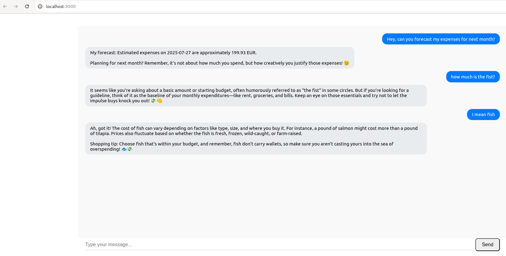

# 💬 FinFun Chat Frontend (React + TypeScript + CoreUI)

This is the frontend application for the **FinFun Chat** — a friendly AI assistant that forecasts your expenses and chats with you in a fun, engaging way.

---

## 🖥️ Screenshot



---

## 🚀 Features

- Responsive chat interface with message bubbles  
- Expense forecasting integrated via backend API  
- Fun, playful AI replies powered by OpenAI GPT-4  
- Input with underline styling and dynamic send button  
- Auto-scroll on new messages  
- Built with React, TypeScript, and CoreUI components  

---

## 🛠️ Setup & Run

1. **Clone the repository**
```bash
git clone https://github.com/your-repo/finfun-chat-frontend.git
cd finfun-chat-frontend
```

2. **Install dependencies**
```bash
npm install
```

3. **Start the development server**
```bash
npm start
```

4. Open your browser at `http://localhost:3000` to see the app.

---

## 🔧 Configuration

- Ensure the backend API is running and accessible at `/api/assistant/chat`
- You can adjust API base URL in the React code if needed

---

## 📂 Project Structure

```
src/
├── components/
│   └── ChatPage.tsx
├── images/
│   └── finfun_ui_screenshot.png
├── App.tsx
├── index.tsx
├── ...
```

---

## 🧑‍💻 Usage

- Type your message in the input box at the bottom  
- Press **Enter** or click **Send** button  
- The assistant will reply with forecast or fun message based on context

---

## ✅ License

MIT

---

## ✏️ Author

> Built with ❤️ by quirkfly /with AI assistence/
